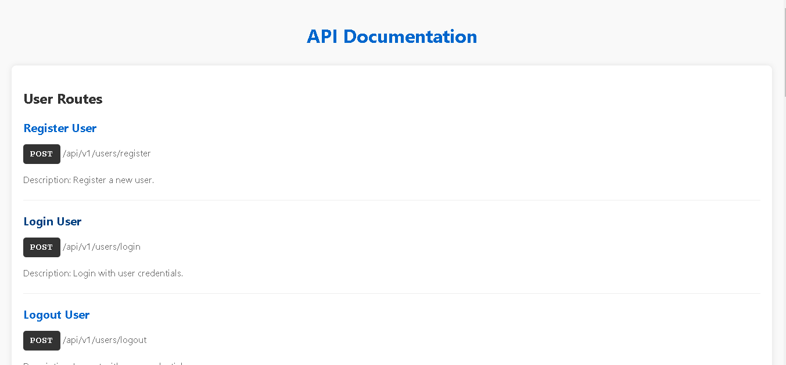

# API Documentation
``
PORT = 4000 

MONGODB_URI =

CLOUDINARY_CLOUD_NAME = 

CLOUDINARY_API_KEY =

CLOUDINARY_API_SECRET = 

RESEND_API_KEY = 

CLIENT_URL = 

JWT_SECRET = 

``

## Installation

Install node modules

```bash
  npm install
```

```bash
  npm run dev
```


## Home Route For Documentation ("/")

This documentation provides details about the endpoints available in the API.

## User Routes

### Register User

- **Method**: POST
- **Endpoint**: `/api/v1/users/register`
- **Description**: Register a new user.

### Login User

- **Method**: POST
- **Endpoint**: `/api/v1/users/login`
- **Description**: Login with user credentials.

### Logout User

- **Method**: POST
- **Endpoint**: `/api/v1/users/logout`
- **Description**: Logout with user credentials.

### Verify User

- **Method**: GET
- **Endpoint**: `/api/v1/users/:userId/verify/:token`
- **Description**: Verify user email using verification token.

### Update User

- **Method**: PATCH
- **Endpoint**: `/api/v1/users/update`
- **Description**: Update user details including avatar.

## Course Routes

### Get All Course

- **Method**: Get
- **Endpoint**: `/api/v1/courses`
- **Description**: Get all available courses.

### Create Course

- **Method**: POST
- **Endpoint**: `/api/v1/courses/create`
- **Description**: Create a new course. (Admin Only)

### Delete Course

- **Method**: DELETE
- **Endpoint**: `/api/v1/courses/:courseId`
- **Description**: Delete a course by ID. (Admin Only)

### Update Course

- **Method**: Patch
- **Endpoint**: `/api/v1/courses/:courseId`
- **Description**: Update a course by ID. (Admin Only)

## Enrollment Routes

### Enroll Course

- **Method**: POST
- **Endpoint**: `/api/v1/courses/enroll/:courseId`
- **Description**: Enroll in a course.

### View Enrolled Courses

- **Method**: GET
- **Endpoint**: `/api/v1/courses/enroll`
- **Description**: View all enrolled courses.


    


## Technologies Used

- ### Node Js
- ### Express
- ### MongoDb
- ### Cloudniary
- ### Resend
- ### JWT
- ### bcrypt


## Authors

### [Vishal Rai](https://github.com/vishalra-i)
## 🌐 Socials:

   - [](https://vishalrai.netlify.app/)
   - [](https://twitter.com/Vishal____rai)
   - [](https://www.linkedin.com/in/vishalrai07/)
   - [](https://www.instagram.com/vishal____rai)
   - [](mailto:vishalrai0392@gmail.com)

